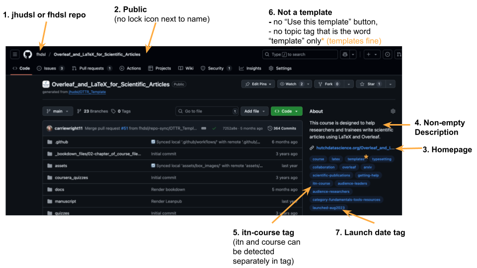
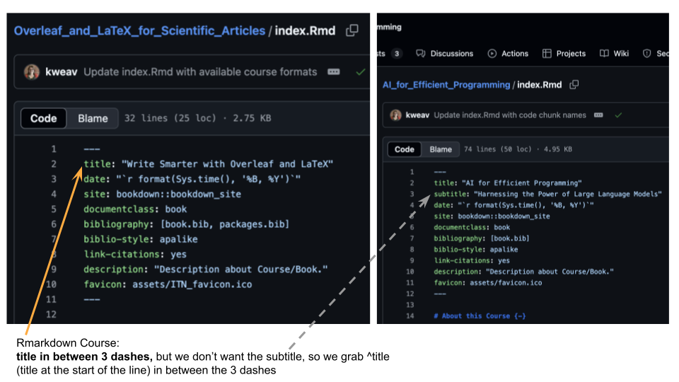
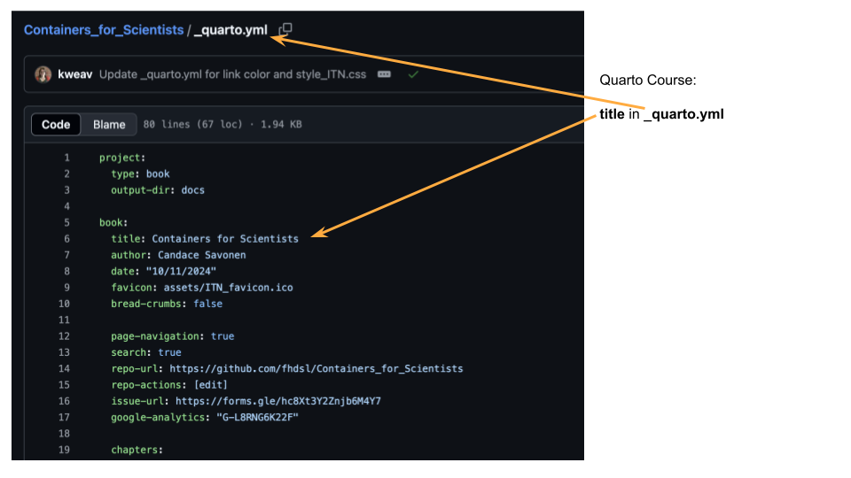
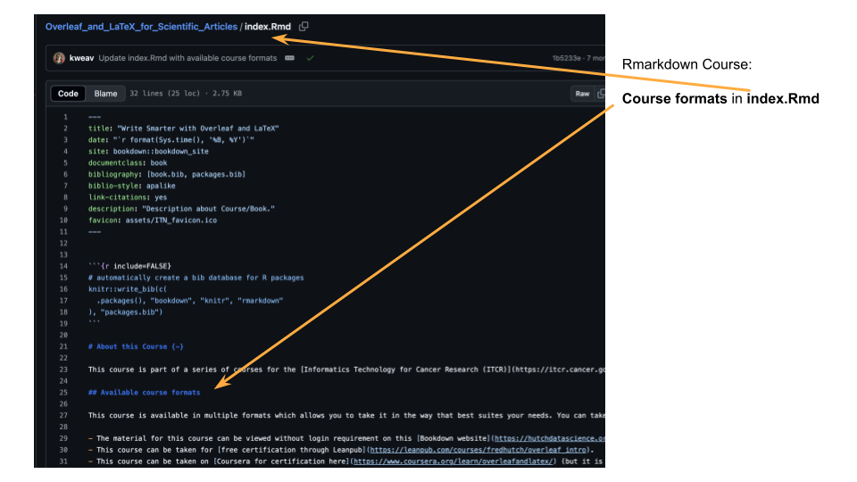
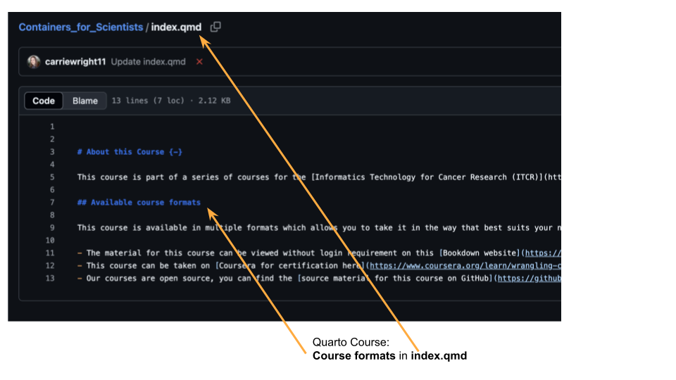
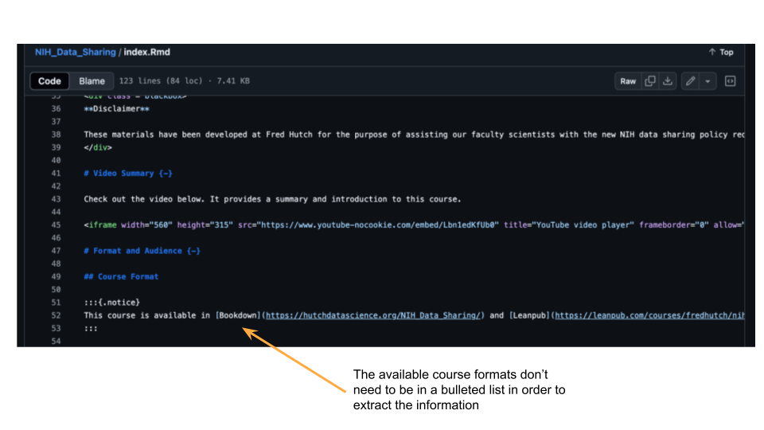
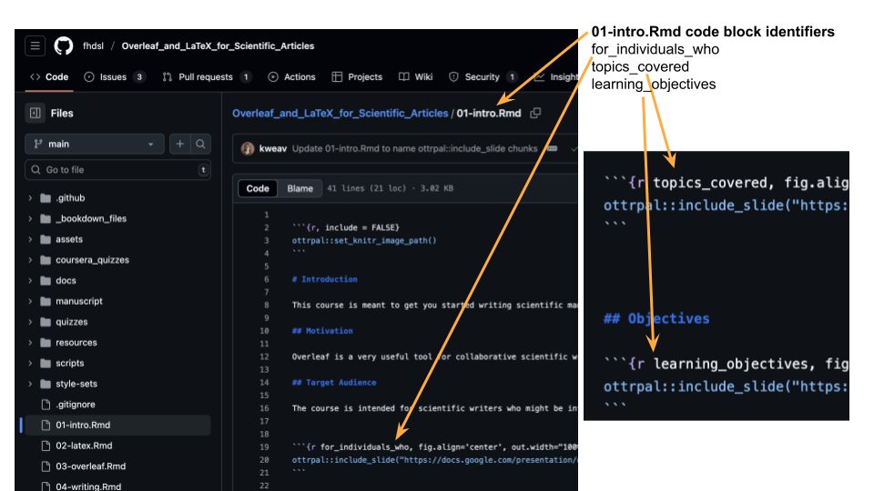
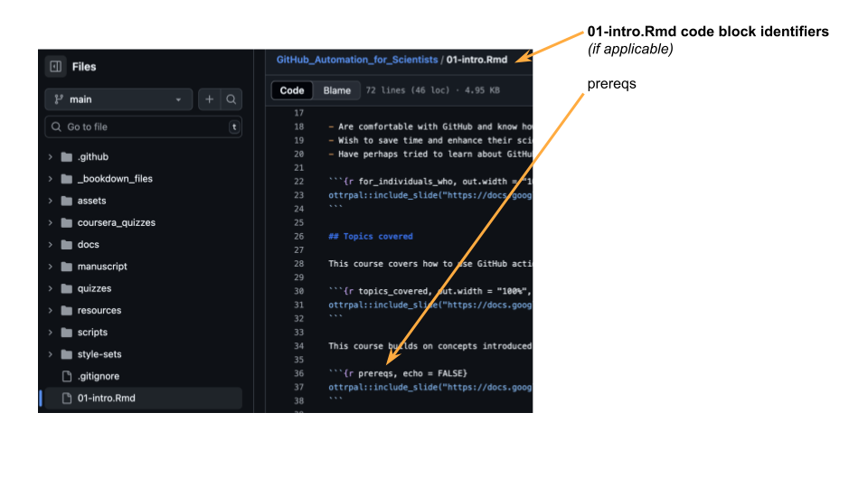
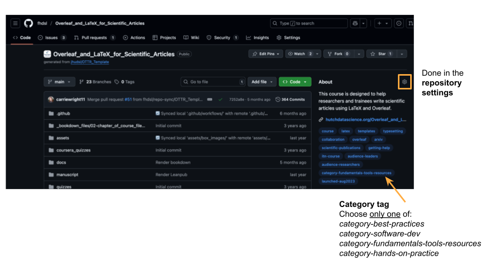

<!-- README.md is generated from README.Rmd. Please edit that file -->

# ITN\_course\_search

A auto-generating searchable table for ITN courses. The collection of
information about the courses is programmatically queried from GitHub
and processed..

## About

ITN\_course\_search uses the Github API to gather jhudsl and fhdsl
organization repositories, specifically ITN courses, that we have worked
on. It renders the table in a markdown-readable format. This repo has
workflows that trigger collection building and table rendering once a
week.

The table only includes repositories that meet the following
**required** criteria:

1.  Repository within the `jhudsl` or `fhdsl` organizations
2.  Public repository
3.  Have a homepage listed
4.  Have a description listed
5.  Have “itn” and “course” as part of the repository tags (e.g.,
    “itn-course”, or “itn” and “course”) (`str_detect(topics, "itn")` &
    `str_detect(topics, "course")`)
6.  Aren’t template per the tags (`!str_detect(topics, "template ")` –
    using a space because we want repos with tags of “templates” if the
    repo is providing templates, e.g., [the Overleaf/LaTeX
    Course](https://github.com/fhdsl/Overleaf_and_LaTeX_for_Scientific_Articles))
7.  Has a repository tag for launch date specified by `launched-monYEAR`
    (e.g., `launched-aug2025` or `launched-dec2023`)

## Interested in adding a course to the table?

At the moment, to add a course to the table, either wait for the repo to
fetch the collection data, or open a PR with a trivial change. A later
PR will add a way to manually trigger the workflow but this is not
available yet.

- ☐ Make sure the above required criteria (1-7) are met (jhudsl/fhdsl
  organization, public, homepage, description, itn-course tag, isn’t a
  template, launch date tag).

Make sure the rest of the information for the table (e.g., title, access
links/available course formats, etc.) is specified (where and how) the
query procedure expects (explained below).

### Course title specification

Course title specification is **within the course material files**,
usually the `index.Rmd` (or `_quarto.yml` for quarto book) file.

- ☐ Verify that the title is in the `index.Rmd` (or `_quarto.yml` for
  quarto book) file.
  - For Rmarkdown courses, need to follow the convention of being listed
    between `---` with `title:` at the front of the line
  - [Quarto books just replaces `title:` to extract the
    title.](https://github.com/fhdsl/ITN_course_search/blob/e389cbd43d2923649e5422c17189d53a812bfb13/scripts/query_collection.R#L149)

Note that the query procedure looks for an `index.Rmd` file first, and
if it doesn’t find one in the repository, it then assumes it could be a
quarto course and looks for the `_quarto.yml` file next automatically.

### Available course formats specification

Available course formats specification is **within the course material
files**, usually the `index.Rmd` (or `index.qmd` for quarto book) file.

- ☐ Verify that available course formats are listed in `index.Rmd` (or
  `index.qmd` for quarto book) file, specifically for Coursera and
  Leanpub if applicable. (The GitHub source material and GitHub pages
  homepage information for the course table will be taken from the API
  call rather than this information, but it’s good practice to have both
  included within this chunk too)

Note that the query procedure looks for an `index.Rmd` file first, and
if it doesn’t find one in the repository, it then assumes it could be a
quarto course and looks for the `index.qmd` file next automatically.

What the code is looking for exactly

Because the `get_linkOI()` function is set up to find line(s) with the
course format “pattern” (e.g., “Coursera” or “Leanpub”), then extract
all URLs from those lines, and then subset to the relevant URL if needed
(again using the “pattern”), these available course formats do not need
to be in an ordered, bulleted, or enumerated list. They could all be
mentioned in a notice box or paragraph. As long as the line with the
link says “Coursera” or “Leanpub”, this process will find and extract
the relevant links.

### Necessary background information and learning objectives specification

Necessary background information and learning objectives are typically
specified as images (Google Slides grabbed with
`ottrpal::include_slide()` function) **within the course material
files**, usually the `01-intro.Rmd` (or `01-intro.qmd` for quarto book)
file. The code blocks where these are specified need to have specific
identifiers.

- ☐ Verify that the `01-intro.Rmd` (or `01-intro.qmd` file for quarto
  courses, [ex: Containers for
  Scientists](https://github.com/fhdsl/Containers_for_Scientists/blob/main/01-intro.qmd))
  file has identifiers for code blocks grabbing relevant google slide
  images.
  - LOs: `learning_objectives`
  - Audience: `for_individuals_who`
  - Topics covered: `topics_covered`
  - Pre-reqs (if applicable): `prereqs`

What the code is looking for exactly

The code in the `get_slide_info()` function within the
`query_collection.R` file looks for these code block identifiers exactly

Note that the query procedure first checks the course name to make sure
it’s not part of a special set of courses that don’t follow the usual
convention/location for this information. If the course isn’t in that
list, the procedure checks for the `01-intro.Rmd` file first and if that
file isn’t found it assumes it could be a quarto course and looks for
`01-intro.qmd` automatically next.

If a different file contains the information, you’ll need to edit the
`get_slide_info()` function within the `query_collection.R` file.

Examples where these blocks aren’t in the expected files include

- AI for Efficient Programming: They’re in
  [index.Rmd](https://github.com/fhdsl/AI_for_Efficient_Programming/blob/main/index.Rmd)
  instead.
- NIH for Data Sharing:
  - LOs are in their own file (and the chunk is commented out, but still
    accessible to this table building)
    [Learning\_objectives.Rmd](https://github.com/fhdsl/NIH_Data_Sharing/blob/main/Learning_objectives.Rmd)
    instead.
  - Audience and Topics covered are in
    [index.Rmd](https://github.com/fhdsl/NIH_Data_Sharing/blob/main/index.Rmd)
- AI for Decision Makers: They’re in 4 different files on 4 difference
  branches – one for each sub-course.

If your course’s introductory material isn’t located within the expected
`01-intro.Rmd` or `01-intro.qmd` file locations, [add the course name
here within
query\_collection.R](https://github.com/fhdsl/ITN_course_search/blob/e389cbd43d2923649e5422c17189d53a812bfb13/scripts/query_collection.R#L245)
and then [add the checking with the alternative file(s) for your course
within this
`else`](https://github.com/fhdsl/ITN_course_search/blob/e389cbd43d2923649e5422c17189d53a812bfb13/scripts/query_collection.R#L278),
following the example of AI for Efficient Programming and NIH for Data
Sharing, unless your course has sub-courses within the main repo (that
aren’t in the table and will need new rows) or information on branches
in which case, you’ll want to [follow the example used for AI for
Decision
Makers](https://github.com/fhdsl/ITN_course_search/blob/e389cbd43d2923649e5422c17189d53a812bfb13/scripts/query_collection.R#L528)
and use a [similar special
function](https://github.com/fhdsl/ITN_course_search/blob/e389cbd43d2923649e5422c17189d53a812bfb13/scripts/query_collection.R#L383)

### Audience specification

Audience specification is **not within the course material files** but
instead **is within the repository settings**

- ☐ Add repo tags for audience (at least one of the following):
  - `audience-software-developers`
  - `audience-researchers`
  - `audience-leaders`

What the code is looking for exactly

[The code in the `query_collection.R` file that traverses the pages of
the GitHub API request results looks for these tags
exactly.](https://github.com/fhdsl/ITN_course_search/blob/e389cbd43d2923649e5422c17189d53a812bfb13/scripts/query_collection.R#L490-L496)

### Category specification

Category specification is **not within the course material files** but
instead **is within the repository settings**.

- ☐ Add repo tags for category (only one of the following):
  - `category-best-practices`
  - `category-software-dev`
  - `category-fundamentals-tools-resources`
  - `category-hands-on-practice`

What the code is looking for exactly

[The code in the `query_collection.R` file that traverses the pages of
the GitHub API request results either looks for these tags exactly
(which is the case for `category-software-dev` and
`category-best-practices`), or it looks for the prefix
(`category-fundamentals-` rather than the full
`category-fundamentals-tools-resources` and `category-hands-on-` rather
than the full
`category-hands-on-practice`).](https://github.com/fhdsl/ITN_course_search/blob/8facb2d4ec0a9beca5612a3277457881a2e9bcee/scripts/query_collection.R#L498-L506)

### Funding

All courses with an `itn-course` or just `itn` tag are assumed to be ITN
funded. Add a `hutch-course` topic tag to the repo if it was Hutch
funded and should include Hutch branding as well.

### Cleaning up topic tags for display in the table

The `query_collection.R` file does some removal of topic tags but
generally does NOT clean the topic tags data. Topic tags that are
removed include `data4all` and `reproducible-research` (dasl course
categorization tags) as well as the tags that provide information on
funding, audience, category, and launch date. Additionally, we remove
the tag just “reproducibility” as this is redundant information
(`mutate(across(starts_with("topics_"), ~replace(., str_detect(., "audience-|category-|course|launched-|data4all|reproducible-research|^reproducibility$"), NA))) %>%`).

Very minimal cleaning is done within the `prep_table()` function within
the `format-tables.R` script. This minimal cleaning includes (1)
inserting a line break and a bullet point in place of every semicolon
(which separates the topic tags in the collection following querying)
and (2) replacing hyphens with a space. Special cases or substitutions
of cleaning are handled within `index.Rmd` of this ITN\_course\_search
repo, specifically in the `wrangle_data` code chunk.

Within that chunk …

1.  Use title case on the concepts with the `str_to_title()` function
    because the repo topic tags are all lower case.
2.  Ai –&gt; AI (for the AI for Efficient Programming and AI for
    Decision Makers courses)
3.  Ci-Cd –&gt; Continuous Integration/Continuous Deployment (for the
    Containers for Scientists Course)
4.  Nih –&gt; NIH (for the Data Management and Sharing for NIH Proposals
    course)
5.  Hipaa –&gt; HIPAA (for the Ethical Data Handling for Cancer Research
    course)
6.  Llm –&gt; LLM (for the AI for Efficient Programming course)
7.  Phi –&gt; (PHI) (for the Ethical Data Handling for Cancer Research
    course)
8.  Pii –&gt; (PII) (for the Ethical Data Handling for Cancer Research
    course)
9.  Arxiv –&gt; ArXiv (for the Overleaf and LaTeX course)
10. Latex –&gt; LaTeX (for the Overleaf and LaTeX course)
11. And –&gt; & (space saving, used for the Choosing Genomics Tools
    course )

Add any additional specific changes to the topic tags for cleaning
within that chunk going forward.

### Adding icons

Audience (column is `BroadAudience`), course categories (column is
`Category`), and funding (column is `Funding`) information adds icons to
the data while building the tables. This is done within the
`prep_table()` function of the `format-tables.R` file. If you are
editing or adding a category to any of these, you will need to update
those `mutate` steps there.

## Important files

- `scripts/query_collection.R`: gathers information (audience, funding,
  topics, etc.) about ITN courses from their GitHub repos
- `resources/collection.tsv`: where the collection from
  `query_collection.R` is stored.
- `scripts/format-tables.R`: functions to wrangle course data and format
  course table
- `index.Rmd`: drives building each course specific html page and the
  overall course table
- `chunks/*Rmd` or `chunks/#.md`: chunks that we’ll borrow using
  `ottrpal::borrow_chapter` (from the `base_ottr:dev` container
  specified in `config_automation.yml`) and fill in {SPECIFIC INFO} for
  course (following the example of our cheatsheets repo). Because of
  this approach, a chunk will only inherit specific information if we
  pass it as a tag replacement. In other words, not every piece of
  information in each row/about a specific course will be available to
  the chunks, only the information we specify as a tag replacement).
  - about: `aboutCourse.md` with “{COURSE\_DESCRIPTION}”,
    “{COURSE\_CATEGORY}”, and “{COURSE\_LAUNCH}” to be provided/replaced
  - audience: `audienceCourse.Rmd` with “{FOR\_SLIDE\_LINK}” and
    “{COURSE\_AUDIENCE}” to be provided/replaced
  - format: `formatFullCourse.Rmd` with “{BOOKDOWN\_LINK}”,
    “{GITHUB\_LINK}”, “{COURSERA\_LINK}”, and “{LEANPUB\_LINK}” to be
    filled in
  - funding: `fundingFullCourse.Rmd` with “{hutch\_funded}” to be filled
    in
  - LOs: `loCourse.Rmd` with “{LO\_SLIDE\_LINK}” to be provided/replaced
  - concepts discussed: `conceptsCourse.Rmd` with
    “{CONCEPTS\_SLIDE\_LINK}” tag to be provided/replaced
  - pre-requisites: `prereqsCourse.Rmd` with “{PREREQ\_SLIDE\_LINK}” and
    “{GITHUB\_LINK}” tags to be provided/replaced. If there are
    pre-requisites for a course, and you want to add a direct link to
    them, look at or add to the conditionals in this particular `.Rmd`
- `*_template.Rmd`: the template for driving course specific pages.
  - `single_course_template.Rmd`: layout for building general course
    pages
  - `ai_course_template.Rmd`: layout for AI for Decision Makers course
    page
- `*_coursePage.html`: the output course specific html pages
